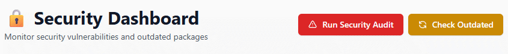
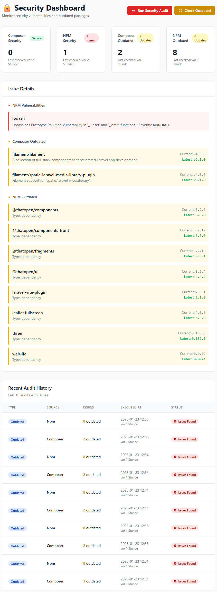
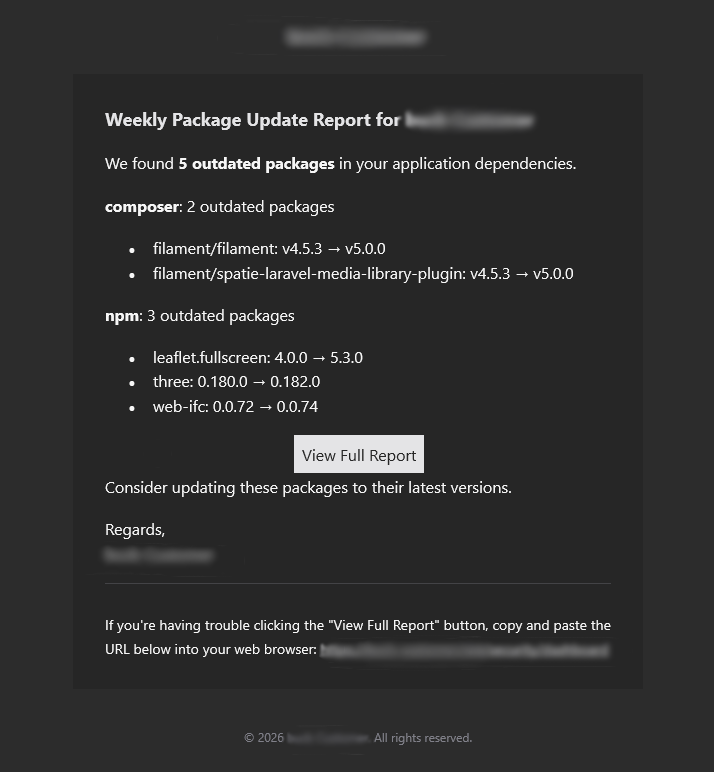
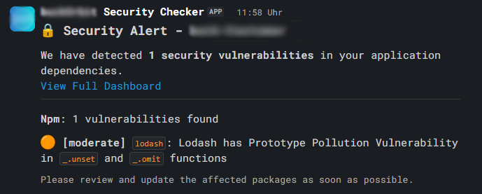
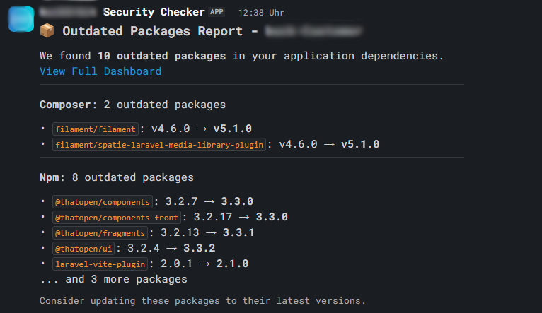

# Laravel Security Package

[](https://packagist.org/packages/xchimx/laravel-security)
[](https://github.com/xchimx/laravel-security/actions?query=workflow%3Arun-tests+branch%3Amain)
[](https://github.com/xchimx/laravel-security/actions?query=workflow%3A"Fix+PHP+code+style+issues"+branch%3Amain)
[](https://packagist.org/packages/xchimx/laravel-security)



A Laravel package for automated monitoring of security vulnerabilities and outdated packages in Composer and NPM dependencies.

## Installation

You can install the package via composer:

```bash
composer require xchimx/laravel-security
```

You can publish and run the migrations with:

```bash
php artisan vendor:publish --tag="security-migrations"
php artisan migrate
```

You can publish the config file with:

```bash
php artisan vendor:publish --tag="security-config"
```

Customize the `config/security.php` file according to your requirements or set the corresponding ENV variables:

```env
# App Info
APP_NAME=MyApp
APP_URL=https://myapp.com

# Security Audit
SECURITY_AUDIT_ENABLED=true
SECURITY_AUDIT_TIME=02:00
SECURITY_AUDIT_COMPOSER=true
SECURITY_AUDIT_NPM=true

# Outdated Checks
SECURITY_OUTDATED_ENABLED=true
SECURITY_OUTDATED_TIME=03:00
SECURITY_OUTDATED_COMPOSER=true
SECURITY_OUTDATED_NPM=true

# Notifications
SECURITY_NOTIFY_USER_ID=1
SECURITY_NOTIFICATIONS_USER_MODEL=App\Models\User
SECURITY_NOTIFICATIONS_ROUTE=admin.security
SECURITY_NOTIFY_MAIL=true
SECURITY_NOTIFY_DATABASE=true
SECURITY_NOTIFY_DATABASE_MAIL=false
SECURITY_NOTIFY_SLACK=false
SECURITY_MAIL_TO=admin@example.com
SLACK_BOT_USER_OAUTH_TOKEN=xxx-xxx-xxx
SLACK_BOT_USER_DEFAULT_CHANNEL="#security-alerts"
```

Optionally, you can publish the views using

```bash
php artisan vendor:publish --tag="security-views"
```

## Usage

The package automatically registers the following tasks in the Laravel Scheduler:

- **Security Audit**: Daily at 02:00 (configurable)
- **Outdated Check**: Weekly on Mondays at 3:00 a.m. (configurable)

Ensure that the Laravel Scheduler is running:

```bash
* * * * * cd /path-to-your-project && php artisan schedule:run >> /dev/null 2>&1
```

### Manual Usage

```bash
# Perform security audit
php artisan security:audit

# Check Composer only
php artisan security:audit --composer

# Check NPM only
php artisan security:audit --npm

# Check for outdated packages
php artisan security:outdated

# Check Composer only
php artisan security:outdated --composer

# Check NPM only
php artisan security:outdated --npm
```

### Dashboard Component

Integrate the Security Dashboard Component into your Blade views:

```blade
<x-security-security-dashboard />
```

### Programmatic Access

```php
use Xchimx\LaravelSecurity\Models\SecurityAudit;

// Retrieve latest Composer audit
$audit = SecurityAudit::getLatestAudit('composer');

// Latest outdated check for NPM
$outdated = SecurityAudit::getLatestOutdated('npm');

// All audits with issuesen
$issues = SecurityAudit::withIssues()->get();

// Audits from the last 7 days
$recent = SecurityAudit::where('executed_at', '>=', now()->subDays(7))->get();
```

## Notifications

### Database notifications

Database notifications are sent to the user ID configured in `SECURITY_NOTIFY_USER_ID`. If the user has an email address and `SECURITY_NOTIFY_DATABASE_MAIL` is set to `true`, the notification is also sent to that address

When database notifications are enabled, notifications are stored in the `notifications` table. This requires the standard Laravel notifications migration:

```env
SECURITY_NOTIFY_USER_ID=1 #User ID
SECURITY_NOTIFICATIONS_USER_MODEL=App\Models\User #User Model
SECURITY_NOTIFY_DATABASE=true #Set database notification to enabled
SECURITY_NOTIFY_DATABASE_MAIL=false #User receives database notification without email. Set to “true” if an email should also be sent.
```

```bash
php artisan notifications:table
php artisan migrate
```


### Email notifications

Emails are sent to the address configured in `SECURITY_MAIL_TO`. You can separate multiple addresses with commas:

```env
SECURITY_MAIL_TO=admin@example.com,security@example.com
```

### Slack notifications

Configure your Slack token:

```env
SECURITY_NOTIFY_SLACK=true
SLACK_BOT_USER_OAUTH_TOKEN=xxx-xxx-xxx
SLACK_BOT_USER_DEFAULT_CHANNEL="#security-alerts"
```

## Data model

The `security_audits` table stores:

- `type`: 'audit' or 'outdated'
- `source`: 'composer' or 'npm'
- `results`: JSON with details about the issues found
- `vulnerabilities_count`: Number of security vulnerabilities
- `outdated_count`: Number of outdated packages
- `has_issues`: Boolean flag
- `raw_output`: Raw output of the command
- `executed_at`: Time of execution

## Requirements

- PHP ^8.2
- Laravel ^11.0
- Composer (installed on the server)
- NPM (Optional if NPM packages are to be checked)

## Testing

```bash
composer test
```

## Changelog

Please see [CHANGELOG](CHANGELOG.md) for more information on what has changed recently.

## Credits

- [Tobias Schottstädt](https://www.schottstaedt.net)

## License

The MIT License (MIT). Please see [License File](LICENSE.md) for more information.

## Views

Dashboard


Mail Notification


Slack Notification Audit


Slack Notification Outdated

